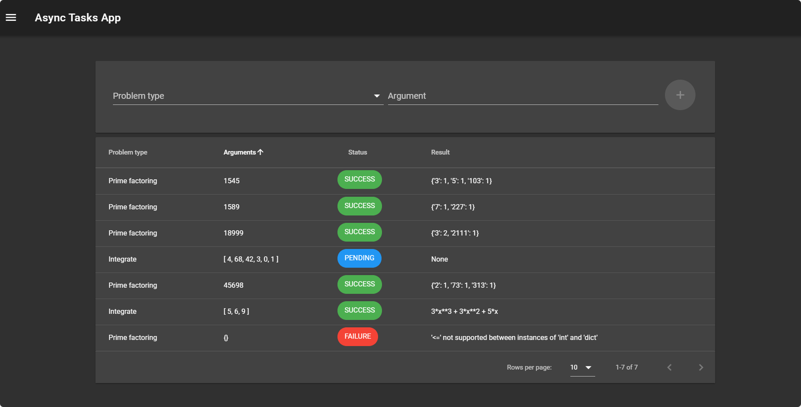
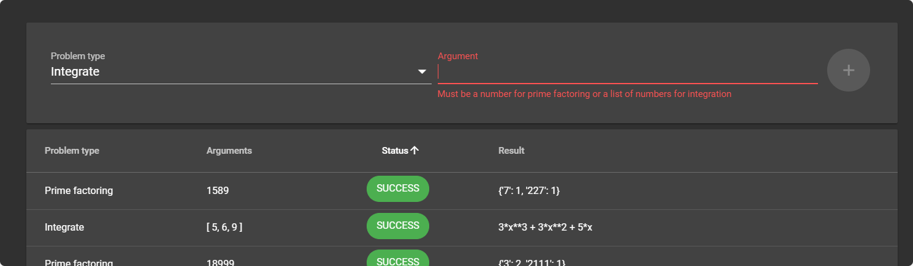
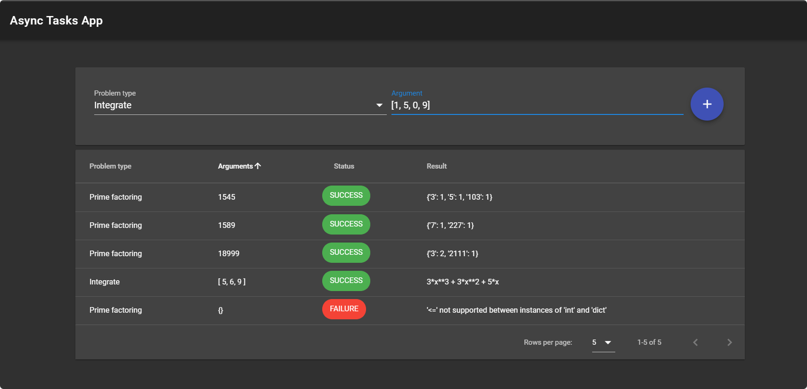

# Async Tasks Apps

This is a full-stack app developed using Django Rest Framework, Celery, PostgreSQL, RabbitMQ and Vue.js in a master/slave configuration all dockerized.





## App Usage

First select the problem you want to solve and then input as follows:

* *Integrate*: a JSON list with the coefficients of the single variable polynomial to integrate (from low to higher order).

   For example: [1, 6, 0, 5] is the polynomial 1 + 6x + 5x**3
      

   Returns a string representation of the integration result.

* *Prime factoring*: int number

    Returns a dict where keys are the prime factors and its value the exponent.

## Setup

### Master Server

This contains the frontend app, the REST API, PostgreSQL database and the RabbitMQ broker.
First you must build the frontend app image:

1. cd into frontend_tasks directory
2. ```docker build . -t tasks_frontend```

Then build up the whole master solution:

1. cd into the root directory (tasks_project)
1. ```docker-compose run web python /code/manage.py migrate```
1. ```docker-compose up```.

### Slave Worker

This is the Celery worker that executes the tasks and sends back the result to the result backend (RabbitMQ).
Set the IP address and exposed RabbitMQ port from the master server on ```tasks_slave.py``` for the broker and backend.

If settings are left as default the exposed port on the master server should be 5673. Otherwise change the docker-compose port bindings.

Then:

1. cd into slave_worker directory.
1. ```docker build . -t slave_worker```
2. ```docker run slave_worker celery worker -l info -A tasks_slave```

## TODO List

* Unit tests for REST API and Celery worker tasks
* SSL activation for RabbitMQ
* Random problem type/argument generation on frontend
